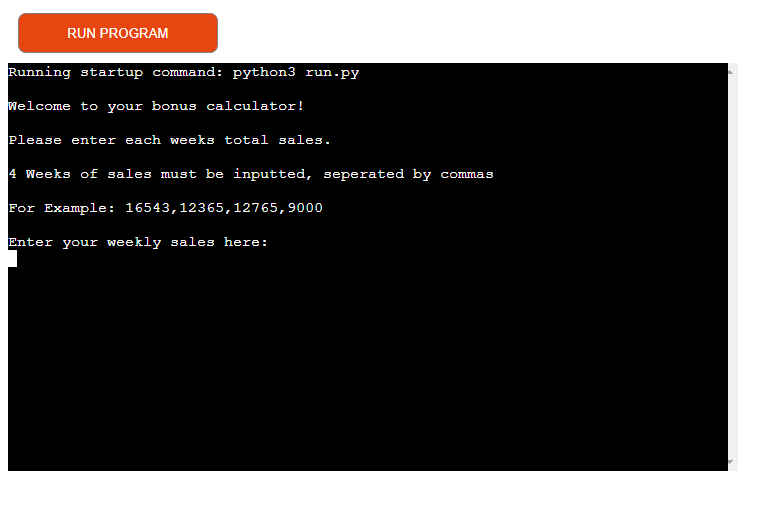
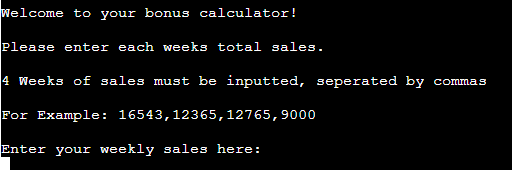
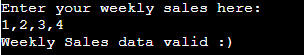
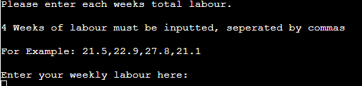
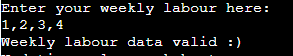
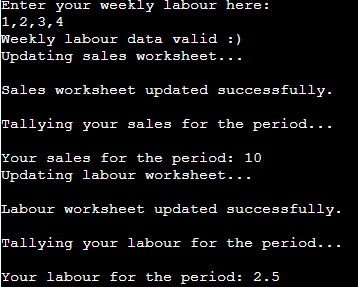
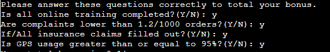
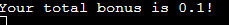
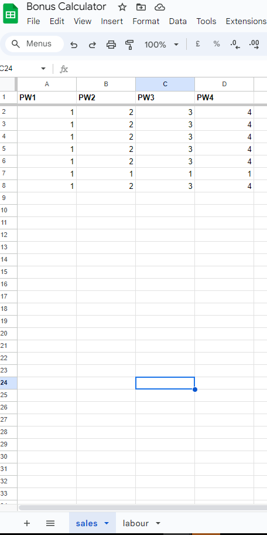
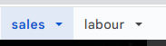

## Dominos Bonus Calculator

## Purpose
- The Bonus Calculator is a command line tool that is designed to help aid my fellow managers in the dominos stores, it will take the sales and labour for each week during the period as well as asking a few Y/N questions, with this information it will calculate the total bonus for the period.

- The link to the deployed project is [HERE](https://pp3-bonus-calculator-62308c600dcf.herokuapp.com/)

## Planning
### Flow Charts
- Below is a flow chart that I created to plan the layout of the project. Using a flowchart allowed me to have a clear vision of what I need to do and how my program should run.

[HERE](assets/images/flowchart.PNG)

### Target Audience
- This is mainly targeted towards Dominos Managers that would like to be able to caluculate/predict their monthly bonus with ease.
- Help newer managers understand how they get their bonus.

### User Stories
- As a user I want to be able to see my predicted bonus.
- As a user I want to be able to see how my bonus is calculated.
- As a user I want to be able to navigate through the calulcator with ease.

### Site Aims
- Inform the user their predicted bonus.
- Display to newer or less knowledgeable managers how a bonus is calculated.
- Allow the user to easily work their way throught the calculator.
- The user to return everytime they want to calculate their bonus.

## Features/Design
### Walkthrough

- On inital run of the program, you're prompted to enter sales data along with a set of instructions. Please note that the data used here is dummy data and not real data.

- After entering a correct data set, you will recieve feedback stating that your data is valid. This will update in the excel file.

- Then you will be prompted to enter labour data with a set of instructions. 

- After entering a correct labour data set, you will recieve feedback that your data is valid. This will update in the excel file.

- Furthermore, you're total sales will be tallied then your labour will be averaged and displayed to you.

- You will then be prompted to answer 4 Y/N questions which will help calculate your bonus.

- Finally, your bonus will be display to you.

### Google Sheets File
- I have connected Google Sheets through the gspread import, this was to allow the managers to refer back to their sales and labour they have inputted into the calculator.

### Interactibility
- There is only one button that can be pressed, everything else is purely based through the keyboard.
- The "Run Program" button is built into Code Institutes Heroku Terminal.
- WASD123 Keys and the "Enter" key are the only keys needed.

## Functions 

- Within this section will be the list of all the functions used to make the calculator work.

### get_period_sales()
- This functions asks the user for 4 figures of data which is their sales data for each week.
- It will print a set of instructions i.e must be 4 sets of data, must be a integer, must be seperated by a comma.

### validate_sales(values)
- This functions validates the users input.
- The function requires only 4 figures seperated by a comma and no more or less than 4.
- If there is more than 4 then an error message will be supplied and the user will be asked to reenter the data.

### update_sales_worksheet(data)
- This function takes the users input and enters it into a new row on the Google Sheet on the sales worksheet.

### total_sales(sales_data)
- This function takes the users input and tallys the total sales for the period.

### get_labour_data()
- This functions asks the user for 4 figures of data which is their labour data for each week.
- It will print a set of instructions i.e must be 4 sets of data, must be a integer, must be seperated by a comma.

### validate_labour(values)
- This functions validates the users input.
- The function requires only 4 figures seperated by a comma and no more or less than 4.
- If there is more than 4 then an error message will be supplied and the user will be asked to reenter the data.

### update_labour_worksheet(labour_data)
- This function takes the users input and enters it into a new row on the Google Sheet in the labour worksheet.

### average_labour(labour_data)
- This functions takes the average of the labour data and uses the statistics library to calculate the mean.

### calculate_bonus(labour_data, sales_data)
- This function takes the labour data and sales data. If the labour data average is higher than 21.0 then there is no bonus.
- However if is lower than 21.0 a series of questions is asked and a percentage of labour is taken away depending on the answer to the questions.
- It will then display the total bonus they will recieve for the period.