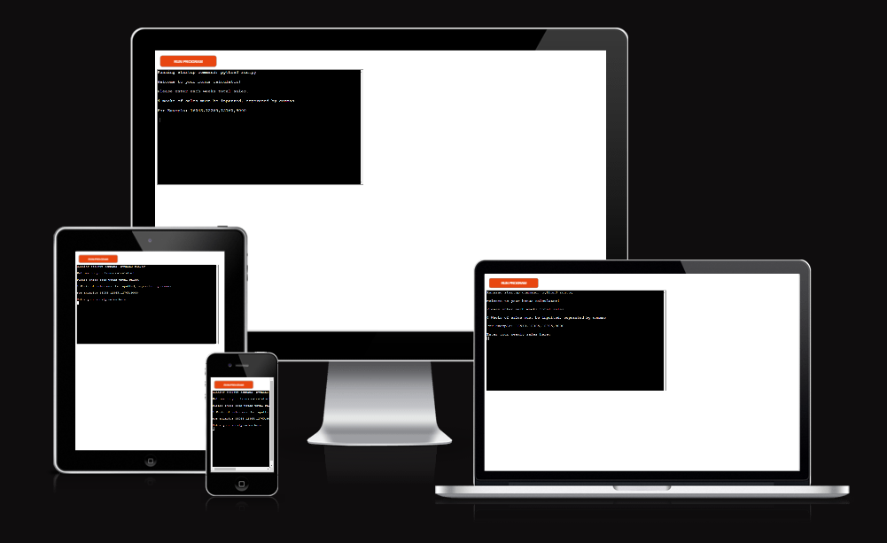
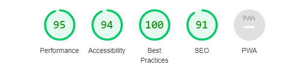

## Dominos Bonus Calculator

## Purpose
- The Bonus Calculator is a command line tool that is designed to help aid my fellow managers in the dominos stores, it will take the sales and labour for each week during the period as well as ask a few Y/N questions, with this information it will calculate the total bonus for the period.

- The link to the deployed project is [HERE](https://pp3-bonus-calculator-62308c600dcf.herokuapp.com/)

## Planning
### Flow Charts
- Below is a flow chart that I created to plan the layout of the project. Using a flowchart allowed me to have a clear vision of what I needed to do and how my program should run.

[HERE](assets/images/flowchart.PNG)

### Target Audience
- This is mainly targeted towards Dominos Managers who would like to be able to calculate/predict their monthly bonus with ease.
- Help newer managers understand how they get their bonuses.

### User Stories
- As a user I want to be able to see my predicted bonus.
- As a user I want to be able to see how my bonus is calculated.
- As a user I want to be able to navigate through the calculator with ease.

### Site Aims
- Inform the user of their predicted bonus.
- Display to newer or less knowledgeable managers how a bonus is calculated.
- Allow the user to easily work their way through the calculator.
- The user is to return every time they want to calculate their bonus.

## Features/Design
### Walkthrough

- On the initial run of the program, you're prompted to enter sales data along with a set of instructions. Please note that the data used here is dummy data and not real data.

- After entering a correct data set, you will receive feedback stating that your data is valid. This will be updated in the Excel file.

- Then you will be prompted to enter labour data with a set of instructions. 

- After entering a correct labour data set, you will receive feedback that your data is valid. This will be updated in the Excel file.

- Furthermore, you're total sales will be tallied then your labour will be averaged and displayed to you.

- You will then be prompted to answer 4 Y/N questions which will help calculate your bonus.

- Finally, your bonus will be displayed to you.

### Google Sheets File
- I have connected Google Sheets through the gspread import, this was to allow the managers to refer back to their sales and labour they have inputted into the calculator.

### Interactibility
- There is only one button that can be pressed, everything else is purely based on the keyboard.
- The "Run Program" button is built into Code Institutes Heroku Terminal.
- WASD123 Keys and the "Enter" key are the only keys needed.

## Functions 

- Within this section will be the list of all the functions used to make the calculator work.

### get_period_sales()
- This function asks the user for 4 figures of data which is their sales data for each week.
- It will print a set of instructions i.e. must be 4 sets of data, must be an integer, and must be separated by a comma.

### validate_sales(values)
- This function validates the user's input.
- The function requires only 4 figures separated by a comma and no more or less than 4.
- If there are more than 4 then an error message will be supplied and the user will be asked to reenter the data.

### update_sales_worksheet(data)
- This function takes the user's input and enters it into a new row on the Google Sheet on the sales worksheet.

### total_sales(sales_data)
- This function takes the user's input and tally the total sales for the period.

### get_labour_data()
- This function asks the user for 4 figures of data which is their labour data for each week.
- It will print a set of instructions i.e must be 4 sets of data, must be an integer, and must be separated by a comma.

### validate_labour(values)
- This function validates the user's input.
- The function requires only 4 figures separated by a comma and no more or less than 4.
- If there are more than 4 then an error message will be supplied and the user will be asked to reenter the data.

### update_labour_worksheet(labour_data)
- This function takes the user's input and enters it into a new row on the Google Sheet in the labour worksheet.

### average_labour(labour_data)
- This function takes the average of the labour data and uses the statistics library to calculate the mean.

### calculate_bonus(labour_data, sales_data)
- This function takes the labour data and sales data. If the labour data average is higher than 21.0 then there is no bonus.
- However, if is lower than 21.0 a series of questions is asked and a percentage of labour is taken away depending on the answer to the questions.
- It will then display the total bonus they will receive for the period.

## 5. Testing

#### Manual testing

| Test Num | Test                                                              | Expected Result                                                                                                  | Correct Outcome |
| -------- | ----------------------------------------------------------------- | ---------------------------------------------------------------------------------------------------------------- | --------------- |
| 1        | Enter valid sales data.                                           | Enter 4 integers, which should return validation from the terminal.                                              | Yes             |
| 2        | Enter invalid sales data.                                         | Enter 4 integers/strings incorrectly, which should return an error message and ask to reinput data.              | Yes             |
| 3        | Enter valid labour data.                                          | Enter 4 integers, which should return validation from the terminal.                                              | Yes             |
| 4        | Enter invalid labour data.                                        | Enter 4 integers/strings incorrectly, which should return an error message and ask to reinput data.              | Yes             |
| 5        | Answer Y/N to different questions and receive the correct result. | Enter Y/N to different questions and receive the correct amount of bonus in comparison to the answered questions | Yes             |

### Other Tests

- I checked to see if this deployed to Heroku, which can be seen [Here](assets/images/bonusinitalscreen.PNG).
- I checked to see if the terminal was responsive. 
- I also checked lighthouse to see if the terminal met the standards.

### Bugs

- I encountered only one bug during the development of my code, everything else was smooth sailing. The bug that was encountered was a gspread library error which was caused by my inputting the incorrect parameter on the function call.

### Future Development

In the future I would be able to add the following:
- Ability to create a full spreadsheet that displays all information about their bonus, sales, and labour for managers.
- Create a GUI for a more enhanced user experience.
- Be able to stop the code without having to run through it.

### Deployment

## Technologies

- Python
- To run - "python3 run.py"

## GitHub

- The steps to deploy are as follows:
  - In the GitHub repository, navigate to the Settings tab.
  - From the source section drop-down menu, select the Master Branch.
  - Once the master branch has been selected, the page will be automatically refreshed with a detailed ribbon display to indicate the successful deployment.

## Heroku Deployment

- Steps to deploy in Heroku are as follows:
    - Log in.
    - Select Create New App.
    - Enter a name for your app.
    - Choose your region either USA or EU.
    - Click on "Create app".
    - To link Google Sheets:
        - Settings.
        - Config Vars.
        - Enter "CREDS" then enter the data in the downloaded file you receive when you set up your Google API.
        - Enter "PORT" and value as "8000".
    - Click Deploy.
    - Select Deploy from GitHub.
    - Enter the GitHub name exactly.
    - Connect.
    - Then click deploy manually.

## Setup a Google API

- The steps to set up a Google API are as follows:
    - Log in.
    - Create a new Google sheet.
    - Use the same name as your app.
    - Go to [Google Cloud APIs](https://cloud.google.com/apis).
    - Click on API manager.
    - Create a new project and name it.
    - Click on Credentials.
    - Enable "Google Drive API" and "Google Sheets API".
    - Go to your Google Drive API, and create new credentials.
    - Enter your name and an email will then be generated.
    - Select the role as Project > Editor.
    - Click on the newly created account.
    - Create a Key.
    - Create JSON Private key.
    - Receive the JSON File.
    - Copy the JSON into the workspace.
    - Take the email from the JSON and share it into your Google sheet.
    - run "pip3 install gspread" in the terminal.

### Credits

## Code Institute

- Love Sandwiches Walkthrough for helping me with my validation and adding to a Google sheet. [Love Sandwiches](https://github.com/Code-Institute-Solutions/love-sandwiches-p5-sourcecode)

## TabletoMarkdown

- tabletomarkdown.com for helping convert my table into markdown. [tabletomarkdown.com](https://tabletomarkdown.com/generate-markdown-table/)

## Time Module Python

- Helped me delay the running of the program to allow for a better user experience.[python.org](https://docs.python.org/3/library/time.html)